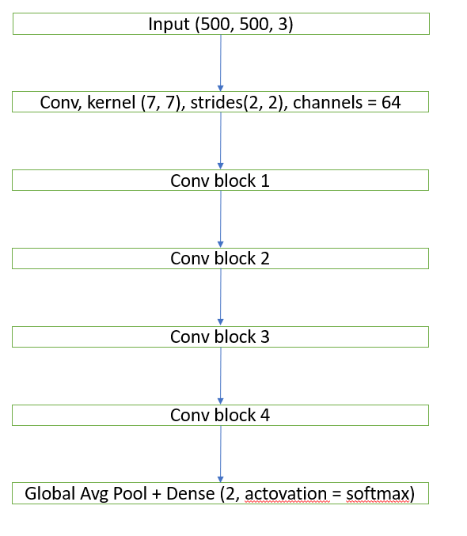

# Project dog-cat-classfication
## 0. Status
This model was only trained with 5000 image data so the efficiency is only 65%. We will improve as soon as possible
## 1. Introduction
This project predicts whether a photo is a dog photo or a cat photo. From the pictures taken from the [link data](https://www.kaggle.com/datasets/shaunthesheep/microsoft-catsvsdogs-dataset). I label them and use them to predict those pictures. Then I deployed it to the local web to import images and display predictions.
## 2. Label the data
- First, i read the path of the stored data and save it to a list.
```{r test-python, engine='python'}
directiry_cat_path = 'data/Petimages/Cat'
file_cat_path = []
directory_dog_path = 'data/PetImages/Dog'
file_dog_path = []
for file_name in os.listdir(directiry_cat_path):
    file_cat_path.append(os.path.join(directiry_cat_path, file_name))
for file_name in os.listdir(directory_dog_path):
    file_dog_path.append(os.path.join(directory_dog_path,file_name))
```
-  Then I create a list of 1's for the dogs label and a list of 0's for cats
```{r test-python, engine='python'}
label_cat = [0] * len(file_cat_path)
label_dog = [1] * len(file_dog_path)
```
- Finally, I created 2 data frames of dogs and cats, then concatenated them and selected 5000 dog images and 5000 cat images to perform training. I save them to a csv file following the path in round brackets
```{r test-python, engine='python'}
# create dataframe
cat_df = pd.DataFrame({'pixel':file_cat_path,'label':label_cat})
dog_df = pd.DataFrame({'pixel':file_dog_path,'label':label_dog})
dataframe = pd.concat([cat_df,dog_df],axis=0,ignore_index=True)
head_5000 = dataframe.head(2500)
last_5000 = dataframe.tail(2500)
dataframe = pd.concat([head_5000, last_5000], ignore_index=True)
# write dataframe to csv
dataframe.to_csv('data/label_data.csv',index=False)
```
## 3. Training Model
### 3.1 Resize image
- I converted all images to the same size (500, 500, 3) to the same model input shape.
```{r test-python, engine='python'}
def resized_image(pixel,max_width,max_height,list_image_resized):
    rs = np.zeros((max_height,max_width,3),dtype=np.uint8)
    height = pixel.shape[0]
    width = pixel.shape[1]
    rs[:height,:width] = pixel
    list_image_resized.append(rs)
```
### 3.2 Training
#### 3.2.1 Split data
I split the data with 0.8 for training and 0.2 for testing.
#### 3.2.2 Create DenseNet
My model consists of 4 Dense blocks. Each block has 4 conv blocks.
1. Conv block: In the transformation block include an activation layer 'Relu', a convolution layer with kernel size of (3,3).
```{r test-python, engine='python'}
def conv_block(x, num_chanels):
    # BatchNormalization
    x = BatchNormalization()(x)
    # add activation layer (Relu)
    x = Activation('relu')(x)
    x = Conv2D(num_chanels,(3,3), padding='same')(x)
    return x
```
2. Dense block: Each dense block has 4 conv blocks.
```{r test-python, engine='python'}
def dense_block(x,num_layers,num_chanels):
    Y = x
    for _ in range(num_layers):
        X = conv_block(x,num_chanels)
        Y = concatenate([Y,X],axis=-1)
    return Y
```
3. Transition block: The transition block includes a relu activation layer, a convolution layer to halve the size, and an average pooling layer. Each Dense block increases the number of channels. But adding too many channels will create a model that is beyond complex. Therefore, a transition layer will be used to control the complexity of the model. This layer uses a 1×1 convolution layer to reduce the number of channels, then an average layer with a step of 2 to halve the height and width, thereby reducing model complexity even further.
```{r test-python, engine='python'}
## create transition block
def transition_block(x):
    x = BatchNormalization()(x)
    x = Activation('relu')(x)
    x = Conv2D(x.shape[-1]//2,(1,1), padding = 'same')(x)
    x = AveragePooling2D()(x)
    return x
```
4. DenseNet



5. Training and save model
```{r test-python, engine='python'}
model.fit(X_train_new, y_train_new,epochs=5, batch_size=32, validation_data=(X_train_new, y_train_new))
model.save('my_model')
```
After saving the model, a "model" folder will be created to contain the model's parameters.
## 4. Deploy model on web
```{r test-python, engine='python'}
from flask import Flask, render_template, request, jsonify
import base64
from PIL import Image
import tensorflow
import numpy as np
import cv2 

def resize(image):
    rs = np.zeros((500,500,3),dtype=np.uint8)
    height = image.shape[0]
    width = image.shape[1]
    rs[:height,:width] = image
    new_array = np.expand_dims(rs, axis=0)
    return new_array

def preprocess_image(image_data):
    # Decode image from bytes and convert it to a NumPy array
    image = cv2.imdecode(np.frombuffer(image_data, np.uint8), cv2.IMREAD_COLOR)
    # Perform any necessary preprocessing (e.g., resizing, normalization)
    image = resize(image)
    return image

app = Flask(__name__)

# # load model
# model = joblib.load('model/cat_dog.pkl')

@app.route("/")
def index():
    return render_template('index.html')

@app.route('/predict', methods=['POST'])
def predict():
    if 'image' not in request.files:
        return 'No file part', 400

    file = request.files['image']
    
    if file.filename == '':
        return 'No selected file', 400
    
    new_model = tensorflow.keras.models.load_model('model/my_model')
    image_data = file.read()
    rs_image = preprocess_image(image_data)
    pred = new_model.predict(rs_image).argmax()
    
    prediction = "Dogs" if pred == 1 else "Cats"
    image_data = base64.b64encode(image_data).decode("utf-8")
    return render_template("result.html", prediction=prediction, img = image_data)
    

if __name__ == '__main__':
    app.run(debug=True)
```
This code will read the newly created model, resize the image and use the model's prediction method to predict the result, then display the result on the web.
- This is the website screen when importing photos

- This is the screen that outputs the prediction results

## 5. Reference
1. [https://flask.palletsprojects.com/en/3.0.x/quickstart/](https://flask.palletsprojects.com/en/3.0.x/quickstart/)
2. [https://www.kaggle.com/datasets/shaunthesheep/microsoft-catsvsdogs-dataset](https://www.kaggle.com/datasets/shaunthesheep/microsoft-catsvsdogs-dataset)
3. [https://d2l.aivivn.com/chapter_convolutional-modern/densenet_vn.html](https://d2l.aivivn.com/chapter_convolutional-modern/densenet_vn.html)